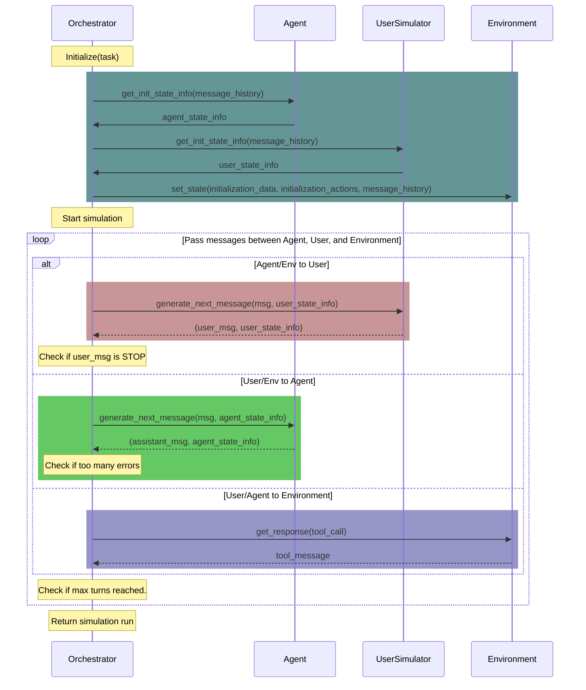

# $\tau^2$-Bench: Evaluating Conversational Agents in a Dual-Control Environment

[](https://www.python.org)
[](https://github.com/astral-sh/ruff)
[](https://github.com/psf/black)
[](https://arxiv.org/abs/2506.07982)

<div align="center">
<br>
<em>Figure 1: τ²-bench allows users to interact with the agent and the environment</em>
</div>

<div align="center">
<br>
<em>Figure 2: Trajectory of a conversation between an agent and a user</em>
</div>

## Overview

$\tau^2$-bench implements a simulation framework for evaluating customer service agents across various domains.

Each domain specifies:
- a policy that the agent must follow
- a set of tools that the agent can use
- a set of tasks to evaluate the agent's performance
- Optionally: A set of tools that the user simulator can use

Domains are:
- `mock`
- `airline`
- `retail`
- `telecom`

All the information that an agent developer needs to build an agent for a domain can be accessed through the domain's API docs.

Once $\tau^2$-bench is installed, to view a domain policy and API docs:

1. Run:
```sh
tau2 domain <domain>
``` 

2. Visit http://127.0.0.1:8004/redoc

## Requirements

- Python >= 3.13.0
- [pdm](https://pdm-project.org/en/latest/)

## Installation

1. Clone the repository:
```bash
git clone https://github.com/sierra-research/tau2-bench
cd tau2-bench
```

2. Create a new environment

Check that you have the correct python version
```bash
python --version
```
You should get `Python 3.13.0`

Create and activate new environment

```bash
python -m venv .venv
source .venv/bin/activate
```

3. Install dependencies

```bash
pdm install
```

4. Provide your LLM API keys

Copy `.env.example` as `.env` and edit it to include your API keys.

5. Set scripts as executable
```bash
chmod +x ./scripts/start_tau2_server.sh
```

6. Install package (required to run the CLI)
```bash
pip install .
```

7. Test the installation
To run a test evaluation on only 5 tasks, run:
```bash
tau2 run \ 
--domain airline \
--agent-llm gpt-4.1 \
--user-llm gpt-4.1 \
--debug-mode
```
(`debug-mode` will limit the results to 5 tasks and 1 trial per task.)

Results will be saved in `data/tau2/simulations/`

### Uninstall
To remove all the generated files and the virtual environment, run:
```bash
make clean
```

## Command Line Interface

The `tau2` command provides a unified interface for all functionality:

### Running Benchmark 
```bash
tau2 run \
  --domain <domain> \
  --agent-llm <llm_name> \
  --user-llm <llm_name> \
  --num-trials <trial_count> \
  --max-concurrency <concurrent_sims> \
  ...
```

### Viewing Results
```bash
tau2 view
```
This tool allows you to:
- Browse simulation files (in `data/tau2/simulations/`)
- View agent performance metrics
- View a particular simulation
- View task details


### View domain documentation
```bash
tau2 domain <domain>
```
Visit http://127.0.0.1:8004/redoc to see the domain policy and API documentation.


## Experiments

### Running Ablation Studies (No User, or Agent with Oracle Plan)
`telecom` domain enables running ablation studies.

1. Running an LLM in `no-user` mode. In this mode, the LLM is given all the tools and the information upfront.
Just choose `llm_agent_solo` as the agent and `dummy_user` as the user.

```bash
tau2 run \
  --domain telecom \
  --agent llm_agent_solo \
  --agent-llm gpt-4.1 \
  --user dummy_user \
  ...
```

2. Running an LLM in `oracle-plan` mode. In this mode, the LLM is given an oracle plan ahead of time alleviating the need for action planning.
Just choose `llm_agent_gt` as the agent.

```bash
tau2 run \
  --domain telecom \
  --agent llm_agent_gt \
  --agent-llm gpt-4.1 \
  --user-llm gpt-4.1 \
  ...
```

### Running Telecom Domain with Workflow Policy
To test the impact of policy format, we provide an additional "workflow" policy for the telecom domain.
To run using this policy, use the `telecom-workflow` domain.

```bash
tau2 run \
  --domain telecom-workflow \
  --agent-llm gpt-4.1 \
  --user-llm gpt-4.1 \
  ...
```

## Domains

For all the details see the domains [README](src/tau2/domains/README.md).

### Basics

- Code is located in `src/tau2/domains/`
- Data is located in `data/tau2/domains/`
- Each domain has its own configuration and task definitions

#### View domain-specific policy and API docs:
Run the following command to see the domain policy and API documentation.
```bash
tau2 env <domain>
```

Then visit http://127.0.0.1:8004/redoc

### Environment CLI (beta)

An interactive command-line interface for directly querying and testing domain environments. Features:
- Interactive query interface with domain-specific tools
- Support for multiple domains (airline, mock, etc.)
- Session management with history

To use:
```bash
make env-cli
```

Available commands:
- `:q` - quit the program
- `:d` - change domain
- `:n` - start new session (clears history)

Example usage:
```bash
$ make env-cli

Welcome to the Environment CLI!
Connected to airline domain.

Query (:n new session, :d change domain, :q quit)> What flights are available from SF to LA tomorrow?
Assistant: Let me check the flight availability for you...
[Flight details will appear here]
```

The Environment CLI is useful for:
- Testing domain tools and queries
- Debugging environment responses
- Exploring available domain functionality
- Quick domain interaction without starting the full server stack


## Run tests
To run the test suite use the command

```sh
make test
```

## Config

To configure the framework, see the [config](src/tau2/config.py) file.

### LLM Calls caching
LLM call caching is disabled by default.

To enable LLM calls caching:
    - Make sure `redis` is running.
    - Update the redis config in `config.py` if necessary.
    - Set `LLM_CACHE_ENABLED` to `True` in `config.py`


## Evaluate Your Own Agent
For local or remote agent evaluation, see our [agent developer guide](src/tau2/agent/README.md).

## Orchestration Sequence Diagram



## Citation

```bibtex
@misc{barres2025tau2,
      title={$\tau^2$-Bench: Evaluating Conversational Agents in a Dual-Control Environment}, 
      author={Victor Barres and Honghua Dong and Soham Ray and Xujie Si and Karthik Narasimhan},
      year={2025},
      eprint={2506.07982},
      archivePrefix={arXiv},
      primaryClass={cs.AI},
      url={https://arxiv.org/abs/2506.07982}, 
}
```